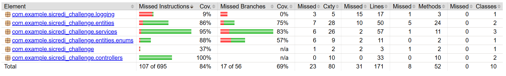
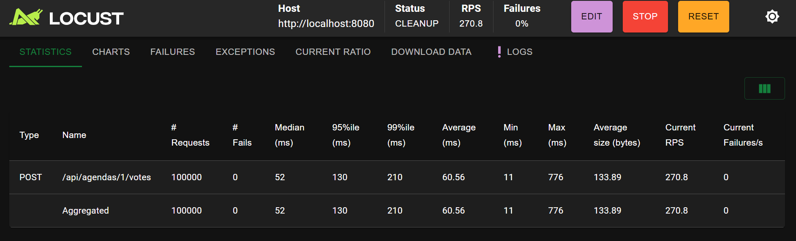

# Sicredi Challenge

API REST para criação de pautas, abertura de períodos de votação, registro de votos e consulta de resultados.

## Links

- [Swagger UI](https://sicredi-challenge-ftdwere0dkb6bfbx.westus3-01.azurewebsites.net/swagger-ui/index.html)
- [OpenAPI JSON](https://sicredi-challenge-ftdwere0dkb6bfbx.westus3-01.azurewebsites.net/v3/api-docs)

## Tecnologias

- Java 21
- Spring Boot 4.1.1
- Spring MVC
- Spring Data JPA / Hibernate
- PostgreSQL 16
- OpenFeign
- Springdoc OpenAPI / Swagger
- JUnit 5 e Mockito
- Docker e Docker Compose
- Azure App Service e Azure Database for PostgreSQL
- GitHub Actions

## Arquitetura

O projeto utiliza uma arquitetura em camadas, adequada ao escopo da aplicação:

```text
Controller -> Service -> Repository -> PostgreSQL
									|
									+-> UserInfoClient (serviço externo de validação)
```

- `controllers`: expõem os endpoints REST e as telas orientadas por JSON.
- `services`: concentram as regras de negócio.
- `repositories`: acesso aos dados com Spring Data JPA.
- `entities`: entidades persistidas e regras do ciclo de vida da pauta e do voto.
- `clients`: integração com o serviço externo de validação do associado.
- `exceptions`: exceções de negócio e tratamento padronizado de erros.

O Spring MVC foi escolhido porque o fluxo é predominantemente síncrono e depende de operações bloqueantes, como acesso ao PostgreSQL e chamada HTTP via Feign. Outra alternativa seria a adoção de WebFlux, no entanto, isso exigiria uma remodelagem dessas integrações bloqueantes atuais.

## Execução local

### Pré-requisitos

- JDK 21.
- Maven 3.9+ ou o Maven Wrapper (`mvnw.cmd` no Windows).
- PostgreSQL disponível em `localhost:5432`.

Crie um banco e um usuário compatíveis com os valores padrão:

```sql
CREATE USER admin WITH PASSWORD 'admin';
CREATE DATABASE db OWNER admin;
```

Execute a aplicação:

```bash
./mvnw spring-boot:run
```

No Windows:

```powershell
.\mvnw.cmd spring-boot:run
```

### Configuração

As propriedades podem ser sobrescritas por variáveis de ambiente:

| Variável | Padrão | Descrição |
| --- | --- | --- |
| `DB_URL` | `jdbc:postgresql://localhost:5432/db` | URL JDBC do PostgreSQL |
| `DB_USERNAME` | `admin` | Usuário do banco |
| `DB_PASSWORD` | `admin` | Senha do banco |
| `APP_HOST` | `http://localhost:8080` | Host usado nas URLs retornadas pelas telas |

O Hibernate está configurado com `ddl-auto: update`, portanto atualiza o schema durante o desenvolvimento. Em produção, recomenda-se utilizar migrations versionadas, como Flyway.

## Docker Compose

O Compose inicia a aplicação e o PostgreSQL. O banco utiliza o volume nomeado `postgres_data`, mantendo os dados mesmo que o container seja recriado.

```bash
docker compose up --build
```

A API ficará disponível em `http://localhost:8080` e o Swagger em `http://localhost:8080/swagger-ui/index.html`.

Para parar os containers:

```bash
docker compose down
```

Para remover também os dados persistidos:

```bash
docker compose down -v
```

## API

### Criar pauta

`POST /api/agendas`

```json
{
	"title": "Aumento do salário em 10%.",
	"description": "Definição do orçamento para o próximo ano"
}
```

A pauta é criada fechada. O período de votação é definido na abertura.

### Abrir pauta

`POST /api/agendas/{id}`

```json
{
	"voting_period": 10
}
```

O período é informado em minutos. Quando omitido ou inválido, a regra atual utiliza 1 minuto.

### Registrar voto

`POST /api/agendas/{id}/votes`

```json
{
	"associate_id": "12345678900",
	"vote": "Sim"
}
```

As opções aceitas são `Sim` e `Não`, também reconhecidas pelas formas `S`, `N`, `SIM` e `NAO`. O associado precisa ser validado pelo serviço externo e só pode votar uma vez na mesma pauta.

A unicidade é garantida no banco pela chave composta `agenda_id + associate_id`, protegendo o fluxo contra requisições concorrentes.

### Consultar resultado

`GET /api/agendas/{id}/result`

O resultado informa o status da pauta (`NAO_ABERTA`, `EM_ANDAMENTO` ou `FINALIZADA`), totais de votos e apuração (`SEM_VOTOS`, `APROVADA`, `REPROVADA` ou `EMPATE`).

### Telas JSON

Os endpoints abaixo retornam estruturas `ScreenResponse` para consumo por uma interface cliente:

| Método | Endpoint | Finalidade |
| --- | --- | --- |
| `GET` | `/api/screens/create-agenda` | Formulário de criação de pauta |
| `GET` | `/api/screens/agendas/{id}/open-agenda` | Formulário para abertura da pauta |
| `GET` | `/api/screens/agendas/{id}/submit-vote` | Tela de votação como formulário|
| `GET` | `/api/screens/agendas/{id}/select-vote` | Tela de votação como seleção |

As URLs de ação retornadas por essas telas são construídas a partir de `APP_HOST`.

## Erros

Os erros seguem o formato:

```json
{
	"code": "RESOURCE_NOT_FOUND",
	"message": "Pauta não encontrada."
}
```

Principais códigos HTTP:

| Status | Situação |
| --- | --- |
| `400` | Dados inválidos, voto duplicado, pauta fechada ou erro de regra de negócio |
| `404` | Pauta ou associado não encontrado |
| `405` | Método HTTP não permitido para a rota |
| `500` | Erro interno inesperado |

## Observabilidade

Cada requisição HTTP gera um log padronizado via Logback contendo:

- timestamp;
- nível do log;
- `requestId`;
- método HTTP;
- caminho;
- status HTTP;
- duração em milissegundos.

O `requestId` é lido do header `X-Request-Id` ou gerado pela aplicação. Ele é devolvido no mesmo header da resposta para facilitar a investigação ponta a ponta.

## Testes e cobertura

Os testes unitários usam JUnit 5 e Mockito e cobrem os serviços e controllers sem depender do banco ou de serviços externos.

Execute todos os testes:

```bash
./mvnw test
```

No Windows:

```powershell
.\mvnw.cmd test
```

O relatório JaCoCo é gerado em `target/site/jacoco/index.html`. Pacotes de configuração, DTOs, exceptions e repositories são excluídos do cálculo por não conterem regras de negócio relevantes.



## Performance

Foi utilizado o Locust para avaliar o comportamento da API sob diferentes níveis de concorrência. Os testes foram executados contra a aplicação implantada e mediram throughput, latência e falhas.

| Usuários | Spawn rate | Requests | Falhas | RPS | Mediana | P95 | P99 | Média | Máx. |
| ---: | ---: | ---: | ---: | ---: | ---: | ---: | ---: | ---: | ---: |
| 10 | 2/s | 3.354 | 0 | **31,1** | 12 ms | 16 ms | 20 ms | — | 755 ms |
| 100 | 50/s | 100.000 | 0 | **270,8** | 52 ms | 130 ms | 210 ms | — | 776 ms |
| 200 | 50/s | 99.994 | 0 | **227,9** | 240 ms | 590 ms | 870 ms | 294,69 ms | 2.526 ms |
| 500 | 100/s | 99.932 | 0 | **93,7** | 1.100 ms | 2.000 ms | 3.800 ms | 1.295,72 ms | 44.616 ms |



Os resultados indicam degradação progressiva da latência e do RPS a partir de 200 usuários concorrentes, especialmente no cenário de 500 usuários. O teste não apresentou falhas, mas evidencia a necessidade de investigar dimensionamento da aplicação, pool de conexões, banco de dados e limites da infraestrutura para cargas maiores.

## Infraestrutura e CI/CD

A aplicação é preparada para execução em Docker e foi implantada no Azure App Service, com PostgreSQL gerenciado no Azure Database for PostgreSQL. A infraestrutura informada do banco é:

- plano `Standard_B1ms`;
- 1 vCore;
- 2 GiB de memória;
- até 640 IOPS;
- 32 GiB de armazenamento.

O pipeline do GitHub Actions é executado em pushes na branch `main` ou manualmente. Ele configura o Java 21, executa o build Maven, publica o JAR como artefato e realiza o deploy no Azure App Service.

## Decisões técnicas

- **Arquitetura em camadas:** reduz a complexidade para o escopo da aplicação e mantém as responsabilidades bem separadas.
- **Spring MVC:** combina melhor com o acesso bloqueante ao PostgreSQL e com a integração Feign utilizada.
- **PostgreSQL:** oferece persistência relacional e constraint de unicidade para impedir votos duplicados em requisições concorrentes.
- **Swagger/OpenAPI:** facilita exploração e integração com a API.
- **Docker:** padroniza a execução local da aplicação e do banco.
- **Azure:** atende à necessidade de hospedagem gerenciada e integração com o pipeline de entrega.
- **GitHub Actions:** automatiza build e publicação com integração direta ao repositório e ao Azure.

## Próximos passos

- **Segurança e controle de acesso:** Adicionar Spring Security com autenticação JWT, autorização por perfil e proteção dos endpoints de criação, abertura e votação. Também validar rate limiting e políticas de CORS.

- **Pool de conexões:** O HikariCP já é utilizado pelo Spring Boot com configurações padrão. Com base nos testes de performance, o próximo passo é medir o consumo real de conexões e ajustar `maximum-pool-size`, `minimum-idle`, timeouts e `max-lifetime` conforme os limites do PostgreSQL e a quantidade de instâncias da aplicação.

- **Infraestrutura Azure:** Os recursos atuais são adequados para desenvolvimento e validação inicial. Para produção, devem ser avaliados o dimensionamento do App Service, o limite de conexões do Azure Database for PostgreSQL, backups, alta disponibilidade, escalabilidade automática e custos.

- **Migrations de banco:** Substituir o `ddl-auto: update` por migrations versionadas com Flyway, garantindo mudanças de schema rastreáveis e seguras entre ambientes.

- **Observabilidade:** O Logback já registra timestamp, nível, `requestId`, método, caminho, status e duração. Como evolução, integrar OpenTelemetry para exportar traces, métricas e logs para ferramentas como Grafana, Datadog ou Dynatrace.

- **Resiliência da integração externa:** Adicionar timeout, retry controlado, circuit breaker e fallback para o serviço de validação de associados, evitando que indisponibilidades externas afetem toda a aplicação.

- **Performance contínua:** Repetir os testes de carga após cada alteração de infraestrutura ou configuração, acompanhando RPS, P95, P99, erros, uso de CPU, memória e conexões do banco.

## Estrutura principal

```text
src/
├── main/java/com/example/sicredi_challenge/
│   ├── clients/
│   ├── controllers/
│   ├── entities/
│   ├── exceptions/
│   ├── repositories/
│   └── services/
├── main/resources/
│   ├── application.yaml
│   ├── logback-spring.xml
│   └── screenshots/
└── test/java/com/example/sicredi_challenge/
```